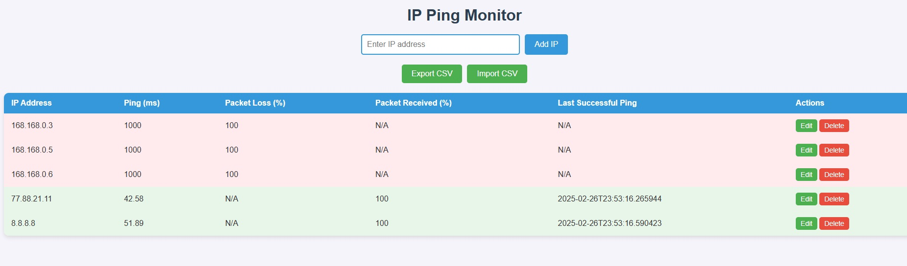

[README.md](https://github.com/user-attachments/files/30795224/README.md)
# 🛰️ Pinger Server

Backend-сервис на FastAPI для мониторинга доступности серверов по IP в реальном времени: асинхронный пинг, хранение истории в SQLite и live-обновление данных на фронтенде через WebSocket — без polling и перезагрузки страницы.



## 📌 О проекте

При старте сервис поднимает базу IP-адресов и запускает фоновую задачу, которая параллельно (asyncio) пингует все добавленные серверы с заданным интервалом. Результаты — задержка (ping), процент потерь пакетов, время последнего успешного пинга — сохраняются в SQLite и рассылаются всем подключённым клиентам через WebSocket раз в 5 секунд.

Список серверов можно вести вручную через REST API или загрузить/выгрузить целиком через CSV.

## ⚡ Возможности

- **Real-time мониторинг** — обновление статусов на фронте через WebSocket без перезагрузки страницы
- **Асинхронный пинг** множества серверов параллельно (`asyncio.gather`), без блокировки event loop
- **REST API** для добавления, редактирования, удаления и просмотра серверов
- **Импорт/экспорт CSV** — можно загрузить список серверов файлом или выгрузить текущее состояние
- **Валидация IPv4** через regex перед записью в базу — невалидные адреса отклоняются или пропускаются при импорте

## 🛠 Стек

`Python 3` · `FastAPI` · `WebSocket` · `aiosqlite` · `aioping` · `uvicorn` · `HTML/CSS/JS` (статика через FastAPI StaticFiles)

## 🏗 Как это работает

```
startup → init_db() → создание таблицы ip_addresses (если её нет)
        → создание фоновой задачи start_pinging()

start_pinging(): бесконечный цикл
        → читает все IP из SQLite
        → пингует их параллельно через aioping (asyncio.gather)
        → пишет результат (ping, packet_loss, last_successful_ping) обратно в БД

/ws (WebSocket): каждые 5 секунд отдаёт клиенту актуальный список серверов из БД
```

Асинхронность здесь — не для галочки: без неё пинг 50+ серверов последовательно занимал бы секунды и блокировал остальной API. `asyncio.gather` позволяет пинговать все сервера параллельно за время одного, самого медленного пинга.

## 📚 API

| Метод    | Путь             | Описание                          |
|----------|------------------|------------------------------------|
| `GET`    | `/`              | Отдаёт фронтенд                   |
| `WS`     | `/ws`            | Real-time поток статусов серверов |
| `GET`    | `/ip/`           | Список всех серверов               |
| `POST`   | `/ip/`           | Добавить сервер                   |
| `GET`    | `/ip/{ip}`       | Получить данные по конкретному IP |
| `PUT`    | `/ip/{old_ip}`   | Изменить IP/данные                |
| `DELETE` | `/ip/{ip}`       | Удалить сервер                    |
| `GET`    | `/export-csv/`   | Экспорт всех серверов в CSV        |
| `POST`   | `/import-csv/`   | Импорт серверов из CSV-файла       |

## 🚀 Быстрый старт

```bash
git clone https://github.com/DmitryGitHab/pinger_server.git
cd pinger_server
pip install -r requirements.txt
uvicorn main:app --reload
```

Открыть [http://localhost:8000](http://localhost:8000) — интерфейс со списком серверов и live-статусами.

## 📈 Что бы улучшил дальше

- [ ] Docker + docker-compose для запуска одной командой
- [ ] Тесты (pytest + `httpx.AsyncClient` для роутов, mock для пинга)
- [ ] Настраиваемый интервал пинга и таймаут через `.env`
- [ ] Авторизация для изменяющих операций (POST/PUT/DELETE)
- [ ] Алерты (email/Telegram) при падении сервера

## 👤 Автор

Dmitry — [GitHub](https://github.com/DmitryGitHab)
